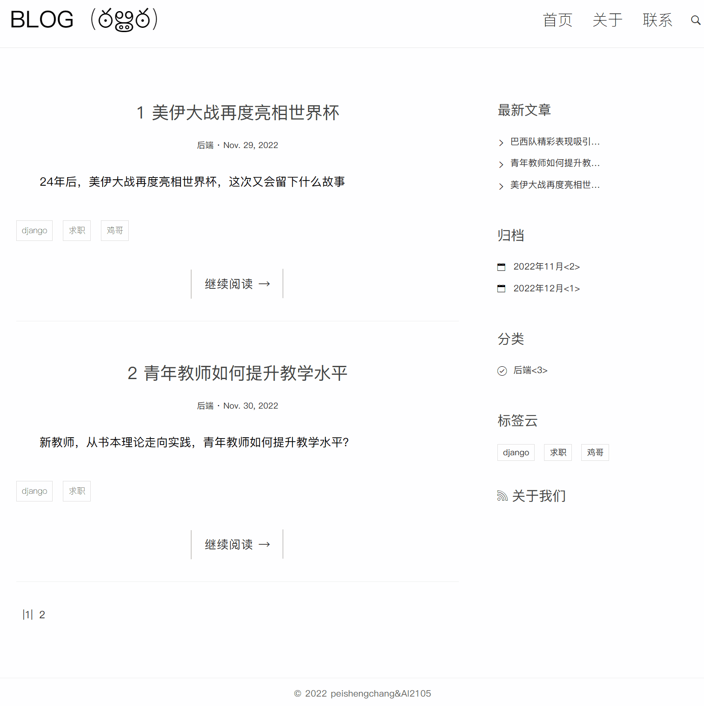

# 基于Django的个人博客

- ## 项目准备

1.新建文件夹blogblog，搭建虚拟环境，激活，装包。
2.创建项目

```
django-admin startproject bolg
```
3.创建应用
```
python manage.py startapp postblog
```
4.安装应用
```
INSTALLED_APPS = [
    'django.contrib.admin',
    'django.contrib.auth',
    'django.contrib.contenttypes',
    'django.contrib.sessions',
    'django.contrib.messages',
    'django.contrib.staticfiles',
    #添加子应用
    'postblog'
]
```
5.本地化
```
#设置中文
LANGUAGE_CODE = 'zh-Hans'
#亚洲上海时区
TIME_ZONE = 'Asia/Shanghai'
```
6.主路由
```
from django.contrib import admin
from django.urls import path,include

urlpatterns = [
    path('admin/', admin.site.urls),
    path('blog/',include('postblog.urls')),
]

```
7.子路由
```
from django.urls import path,re_path
from . import views

urlpatterns = [
    # path('',views.index),
    path('index/', views.index),
    path('index/<int:num>/', views.index),
    path('get/<int:blogid>/', views.DeView),
    path('about/', views.about),
    path('contact/', views.contact),
    re_path(r'^category/(\d+)/$', views.getBlogByCid),
    re_path(r'^guidang/(?P<year>\d+)/(?P<month>\d+)/$', views.getBlogByGuidang),
]
```

- ## 配置

1.装包mysqlclient

```
pip install mysqlclient==2.0.0
```
2.修改DATABASES配置信息
```
DATABASES = {
    'default': {
        'ENGINE': 'django.db.backends.mysql',
        'HOST': '127.0.0.1',  # 数据库主机
        'PORT': 3306,  # 数据库端口
        'USER': 'root',  # 数据库用户名
        'PASSWORD': '',  # 数据库用户密码
        'NAME': 'name'  # 数据库名字
    }
}
```


- ## 迁移

1.生成迁移文件

```
python manage.py makemigrations
```
2.同步到数据库

```
python manage.py migrate
```
3.创建admin用户
```
python manage.py createsuperuser
```



